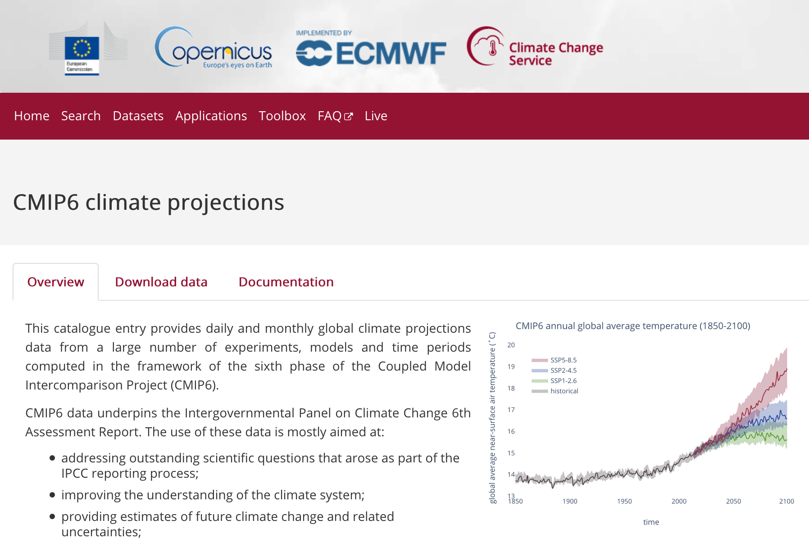
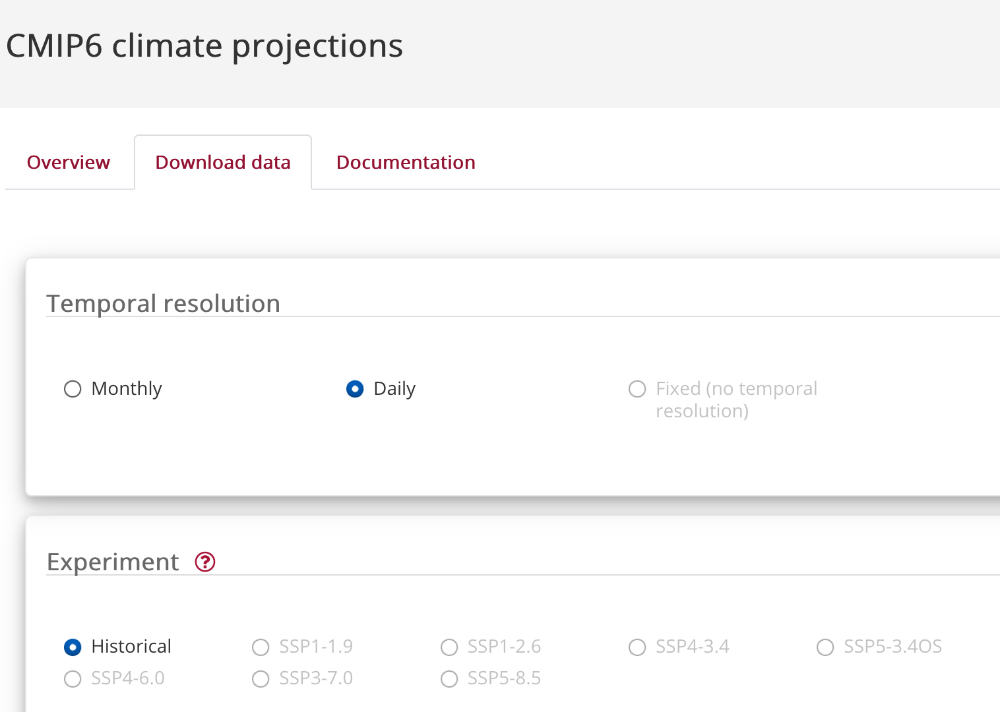
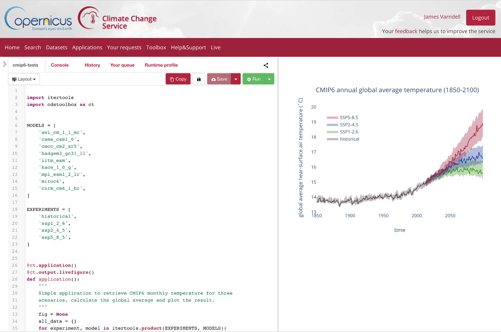
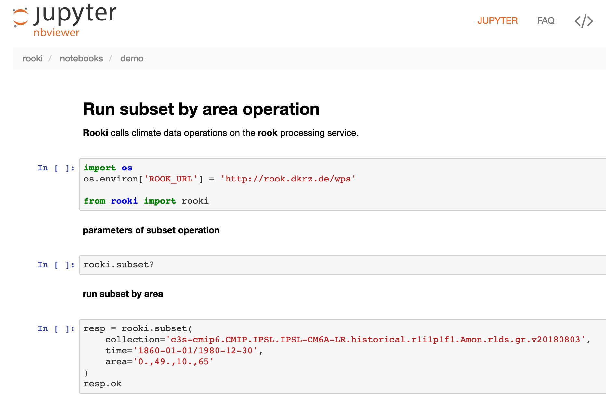
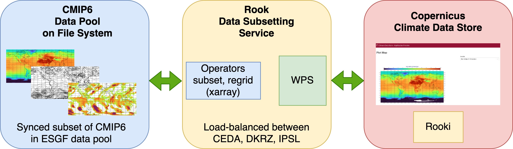
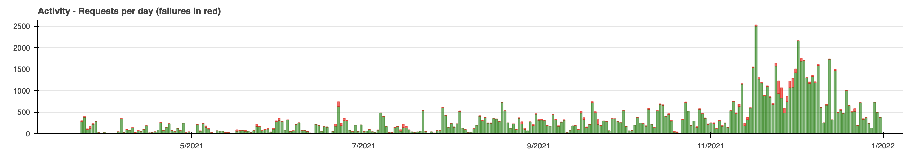

## Rook

Data Reduction Service for the Copernicus Climate Data Store

Carsten Ehbrecht, DKRZ

Kick-off Meeting C3S2_380, 11 February 2022

---
## Rook

Remote Operations On Klimadaten

(The K is not a typo)

A data reduction service

https://rook-wps.readthedocs.io/en/latest/
---
## Climate Data Store
CMIP6 data in CDS is provided using Rook.

---
## Climate Data Store - Download data

---
## Climate Data Store - Toolbox

---
## Climate Data Store - Rook
* Climate data, CMIP6, is accessed remotely
* Whole files are downloaded via data nodes
* Using Rook: download only a subset of the data
* Example: Temperature, 1990, Africa
---
## Web Processing Service

Call a function remotely
---
## Rook - WPS
* An OGC Web Processing Service
* Using PyWPS - GeoPython
* Providing climate data operators as a service
* Used for data reduction: Temperature, 1990, Africa
---
## Rook - Operators
* Subsetting - time, area, level
* Subsetting - time components:
  * year:2016,2017\|month:jan,feb,mar
* Averaging - over dimensions (time, ...)
* Regridding (still a pain!)
* ... can be extended
---
## Rook - Clisops
* The Python library implementing these operators
* Using xarray - low level library
* Joint effort together with [Ouranos, Canada](https://www.ouranos.ca/en/)
https://clisops.readthedocs.io/en/latest/
---
## Rooki
* Python WPS client - interactive or as library
* Using OWSLib - GeoPython
* Joint effort with [Ouranos, Canada](https://www.ouranos.ca/en/)
* https://rooki.readthedocs.io/en/latest/
---
## Rooki - Notebook

[Online Notebooks](https://nbviewer.org/github/roocs/rooki/tree/master/notebooks/demo/)
---
## Deployment - Birdhouse Tools
* Rook generated from a Cookiecutter template
* Ansible playbook to roll out on cluster with Slurm scheduler
* Joint effort with [Ouranos, Canada](https://www.ouranos.ca/en/)
---
## Availability
* Data pool is replicated to three sites
* Load-balanced access to Rook WPS and data nodes
---
## All together

---
## Status - in Production
* Deployed at [CEDA](https://www.ceda.ac.uk/about/team/), [DKRZ](https://www.dkrz.de/en/) and [IPSL](https://www.ipsl.fr/en/home-en/)
* Used for CMIP6
* Subset (time, area, level) operator
* Whole CMIP6 files are downloaded from data nodes
---
## Status - Activity in 2021
200 requests per day ... up to 2500

[Online dashboard](https://roocs.github.io/downloads/dashboard/2021/2021-dashboard.html)
---
## Status: Data

* CMIP6: used since March 2021
* CMIP6-decadal: ready for integration with CDS
* CORDEX: ready for integration with CDS
* CMIP5: ready for integration with CDS
---
## Status: Operators

* Subset: used since March 2021
* Subset with time components: available
* Average: ready for integration with CDS
* Regridding: initial version will be available soon
---
## Next steps in C3S2_380
* Integrate data in CDS
  * CMIP6-decadal, CORDEX, CMIP5
* Updates of existing data pool
* Averaging and Regridding
* New *Concat* operator for CMIP6-decadal
  * `avg(concat(sub(ens1), sub(ens2)))`
* Improve deployment and monitoring
* ???
---
## Issues
* CEDA is not part of C3S2_380
  * CEDA is still online ... backup mode
* With only two sides, the service is less stable
* CEDA is the main driver of the developments
---
## Projects
* Copernicus C3S: https://climate.copernicus.eu/
* Roocs: https://roocs.github.io/
* Birdhouse: http://bird-house.github.io/
* GeoPython: https://geopython.github.io/
---
## Thanks
Questions?
---
