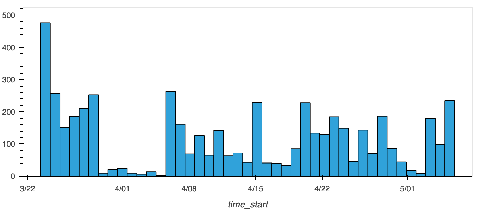
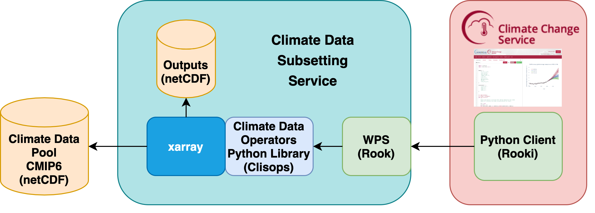

## Rook

A Web Processing Service for the Copernicus Climate Data Store

Ag Stephens, CEDA

Climate Projection Workshop, 6 May 2021

---
## Rook

Remote Operations On Klimadaten

(The K is not a typo)

https://rook-wps.readthedocs.io/en/latest/
---
## Climate Data Store
CMIP6 is now live in CDS ... using rook

---
## Climate Data Store - Download data

---
## Climate Data Store - Toolbox

---
## Climate Data Store - Rook
* The climate data is accessed remotely
* Using rook: download only a subset of the data
* Example: Temperature, 1990, Africa
---
## Web Processing Service

Call a function remotely
---
## Rook - WPS
* An OGC Web Processing Service
* Using PyWPS - GeoPython
* Providing climate data operators as a service
* Used for data reduction: Temperature, 1990, Africa
---
## Rook - Operators
* Subsetting - time, area, level
* Averaging - over dimensions (time, ...)
* Regridding (a pain!)
* ??? - can be extended
---
## Rook - Clisops
* The Python library implementing these operators
* Using xarray - low level library
* Joint effort together with Ouranos, Canada
https://clisops.readthedocs.io/en/latest/
---
## Rooki
* Python WPS client - interactive or as library
* Using OWSLib - GeoPython
* Joint effort with Ouranos, Canada
* https://rooki.readthedocs.io/en/latest/
---
## Rooki - Notebook

---
## Deployment - Birdhouse Tools
* Rook generated from a Cookiecutter template
* Ansible playbook to roll out on cluster with Slurm scheduler
* Joint effort with Ouranos, Canada
---
## Availability
* Data pool is replicated to three sites
* Load-balanced access to rook WPS
---
## Rook - Requests
200 per day ... can serve much more

---
## All together

---
## Status
* Deployed at CEDA and DKRZ
* Used for CMIP6
* Subset (time, area, level) operator
* Original CMIP6 files are downloaded from data nodes
---
## Next steps?
* CMIP6 + Decadal
* CORDEX?
* CMIP5?
* Averaging and Regridding
* Other operations?
---
## Projects
* Copernicus C3S: https://climate.copernicus.eu/
* Roocs: https://roocs.github.io/
* Birdhouse: http://bird-house.github.io/
* GeoPython: https://geopython.github.io/
---
## Thanks
Questions?
---
